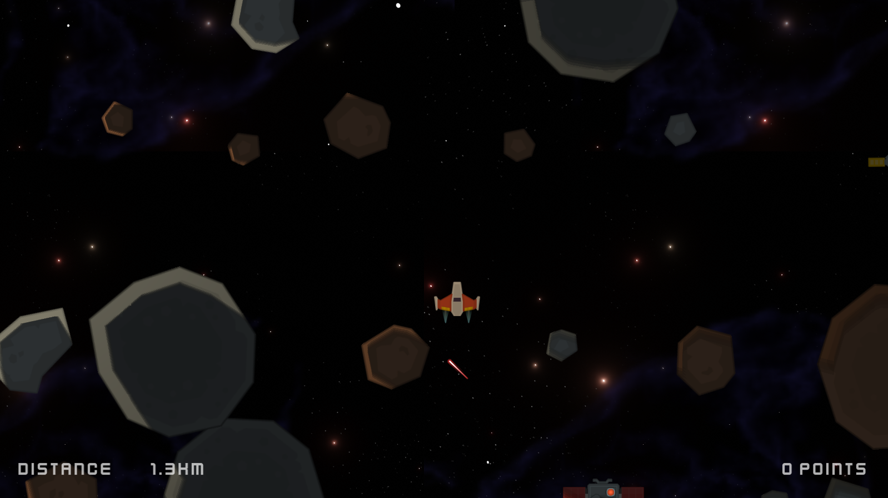

# BLACK HOLE ESCAPE

A game written during the Godot programming course to consolidate my knowledge.

[Preview](https://jstasiaczek.github.io/black_hole_escape/)

## About

You are in the black hole's sphere of influence, you must escape by avoiding incoming asteroids and staying on course ( by avoiding the edges). Can score points by collecting beacons.

Written in Godot 4.2 and GDScript

## Assets

Thruster sound: [Distant Rumble](https://freesound.org/people/primeval_polypod/sounds/159012/) by primeval_polypod

Explosion animation: [Pixel Explosion](https://opengameart.org/content/pixel-explosion-12-frames)

Explosion sound: [5 sounds/short melodies](https://opengameart.org/content/5-soundsshort-melodies)

Beacon effect: [Fireworks Effect Spritesheet](https://opengameart.org/content/fireworks-effect-spritesheet)

Most Assets from [kenney.nl](https://www.kenney.nl/)

